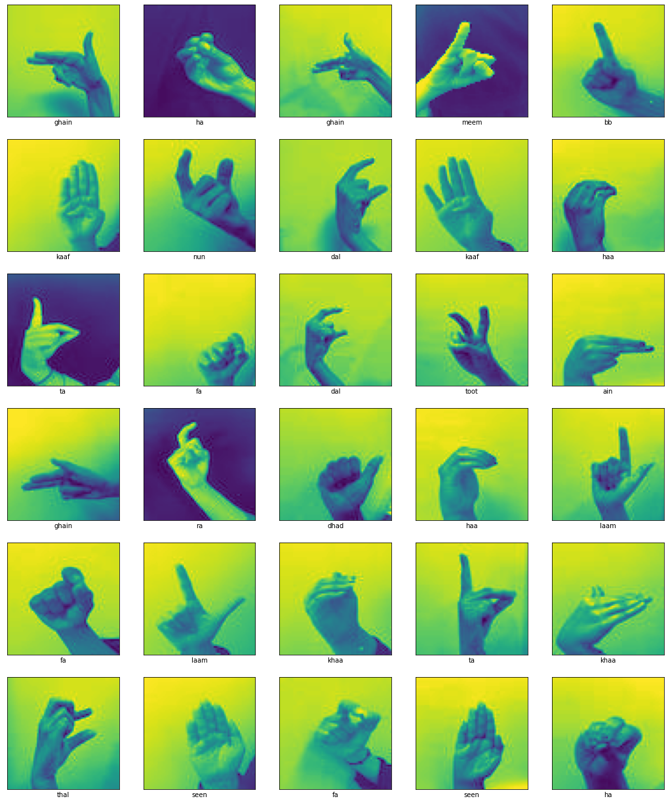
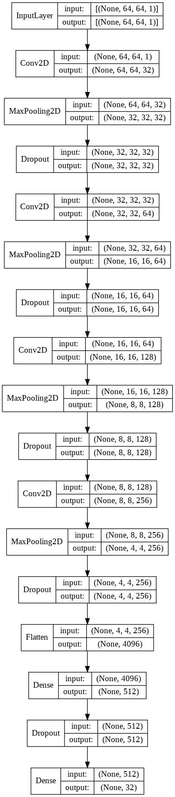
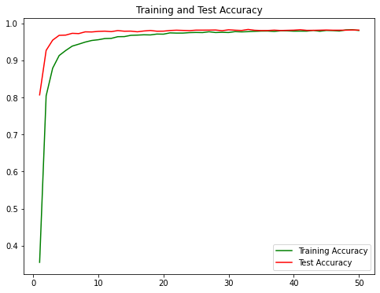
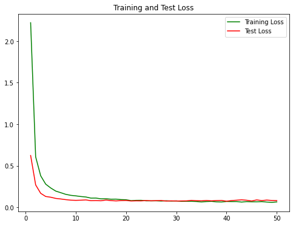

The model detects the Arabic alphabet using computer vision algorithms and CNNs.

# ArASL: Arabic Alphabets Sign Language Dataset
https://www.sciencedirect.com/science/article/pii/S2352340919301283

# CNN

# Model Evaluation

