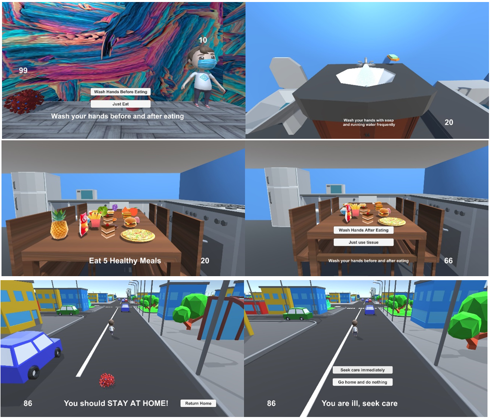

# Abstract
Educational video gaming is a powerful tool in computer graphics. It can help a lot in the current quarantine. In this paper, we have introduced a desktop educational 3D video game that teach kids some instructions to take the necessary precautions during the period of living with COVID-19. The game was implemented using Unity3D platform. It can be run on Windows operating system. It is for a single player. The game put the player in some situations such: as sneezing, coughing or eating to teach him how to behave in those situations. There are two places in the game: the home and the city. When the player is at home, he can eat, wash his hands, watch TV, and move around in home. There are some situations happens and he can decide what to do in those situations. When the player is outside, he can move around in the city, but the enemy (COVID-19) chases him so, he should return home and stay at it to be safe. The enemy has 99 points so, the player should gain 100 points to win. The player gets more points when he behaves well. According to his choices, the points are calculated. The graphics and the animations are suitable for the age of a kid.

# Introduction
At the end of 2019, COVID-19 (Coronavirus) was identified for the first time in Wuhan, China. During the past months, the world suffered from its impact. Many things in our life have been changed because of it. No treatment has been discovered officially until now so, many countries decided to live with the virus to reduce its impact on the global economy. It is hard to live with the virus so, people need to take some precautions to reduce chances of infection of the virus. The World Health Organization (WHO) offers some instruction that help people to take caution [1]. Reading those instructions may be boring for kids. They prefer graphical content over textual content. It is hard to convince a kid to read all these boring instructions so, we need an entertaining alternative method to teach him about Coronavirus. The picture is said to be more informative than speech. Here comes a turn of educational video gaming. It is a powerful tool to teach people how to do things in an entertaining and easy way. Playing is an essential thing for kids. It may be waste of time if the game is useless, but it remains an essential and important thing. Educational video gaming is useful and entertaining at the same time. A kid can invest his time to learn useful skills. Many schools rely on the graphical content to teach students in a fun way [2]. It is not only for teaching kids. Educational video gaming is growing more and more. It can be useful in various fields, especially during those difficult days. It can be used to teach students Math, Arabic, History, programming, as well as, about the emergent virus. Video games makes the complex things easy. The main purpose of this application is teaching kids some instructions that can reduce the chances of being infected or spreading Coronavirus. These instructions are gathered from WHO website. This application can help a lot with kids. Instead of reading those instructions to them, the game teaches them some lessons in an entertaining way in the current quarantine. One more reason for developing this application is to test the extent of knowledge of kids about the precautions that must be taken to protect themselves and their loved ones. For example, many kids don't like to eat vegetables and fruits but, they are important to strengthen their immunity so, the game teach them to eat healthy food. Of course 3D objects is more realistic than 2D objects. For this reason, the game was implemented using Unity3D. It is a powerful easy platform for developing 3D games. 

# Screens

# Game Download and Configuration 
You can download the game from https://bit.ly/2XJFrwU 
You just download the game and open play.exe to select your configurations and start playing. Unity3D provides selecting screen size, graphics quality (very low, low, medium, high very high, ultra) and input buttons to fit many computers. 

