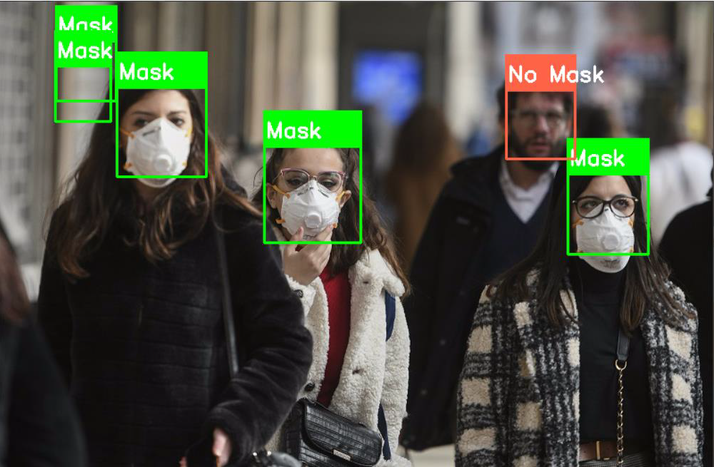
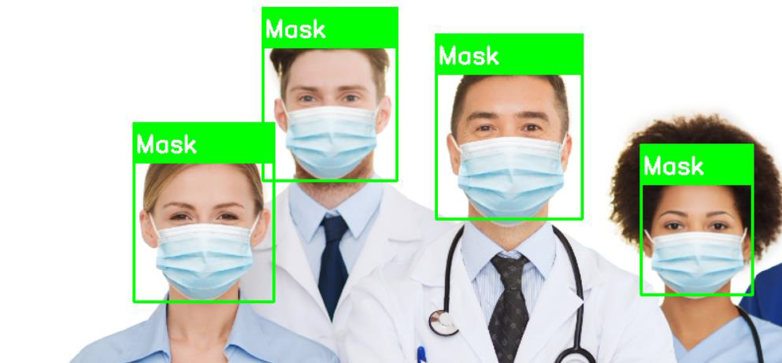

# Description and Problem Statement

At the end of 2019, COVID-19 (Coronavirus) was identified for the first time in Wuhan, China. During the past months, the world suffered from its impact. Many things in our life have been changed because of it. No treatment has been discovered officially until now so, many countries decided to live with the virus. It is hard to live with the virus so, people need to take some precautions to reduce chances of infection of the virus.
The World Health Organization (WHO) offers some instruction that help people to take caution. One of these instructions is wearing masks. In this paper, we will represent a real-time face mask detector using computer vision algorithms and deep learning approach. We aim to build a Convolution Neural Network (CNN) to ensure your safety and the safety of others. The output of the network should be a label which indicating whether the person wears a mask or not. This is a supervised binary classification task.

# Deployment
The deployment of the model involves the following steps:
  1. Loading the trained CNN model.
  2. Loading the Haar Cascade font face detector.
  3. Starting video capturing using a camera.
  4. Using the Haar Cascade to detect the faces in the frame.
  5. Extracting each ROI (face).
  6. Predicting the class of the face using the CNN model.
  7. Drawing a box around each face to identify whether the person is wearing a mask or not.

# Libraries
Numpy                     Scientific computing
Pandas                    Data analysis
Matplotlib & Seaborn      Data visualization
Tensorflow & Keras        Neural Networks (NN) and Deep Learning
Sklearn                   Machine learning and evaluation metrics
OpenCV                    Computer vision

# Conclusion
In this paper, we introduced a real-time face mask detector using CNN and computer vision algorithms. We achieved 99.19% accuracy on the test set. This model can help to ensure the safety in schools, malls, offices, etc… 
Our face mask detector is accurate and efficient.

