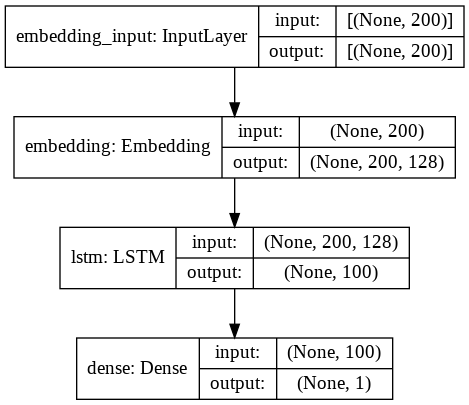
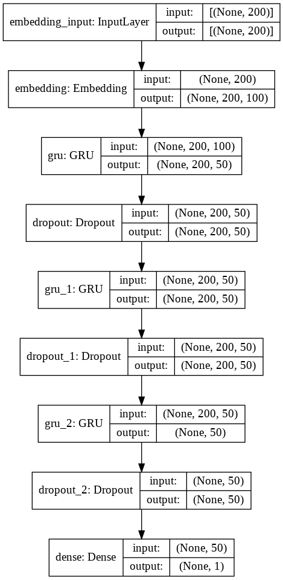
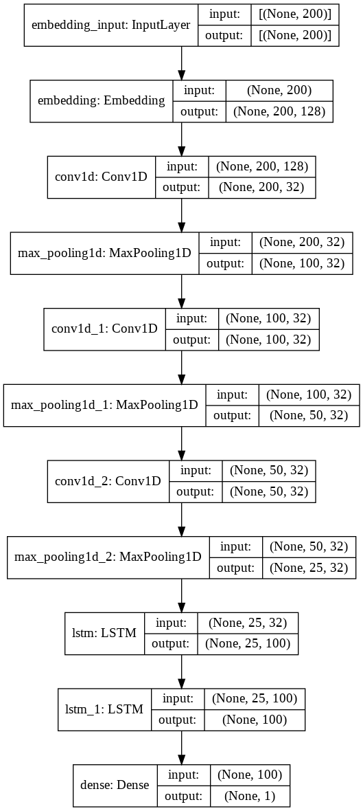

# Detecting different types of toxicity in comments.
Models: LSTM, GRU, CNN-LSTM, BiLSTM

# Dataset
https://www.kaggle.com/c/jigsaw-toxic-comment-classification-challenge

# LSTM
Accuracy:	96.28%

# GRU
Accuracy:	96.25%

# CNN-LSTM
Accuracy:	96.30%

# BiLSTM
Accuracy:	96.27%

