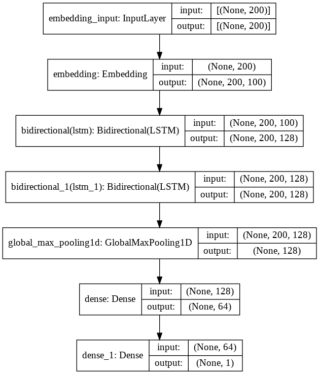

# Detecting different types of toxicity in comments.
Models: LSTM, GRU, CNN-LSTM, BiLSTM

# Dataset
https://www.kaggle.com/c/jigsaw-toxic-comment-classification-challenge

# LSTM

# GRU

# CNN-LSTM

# BiLSTM

